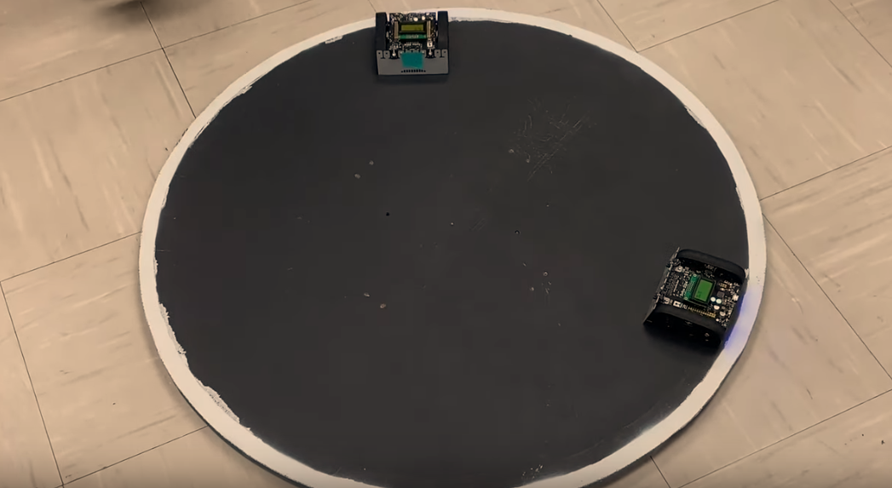
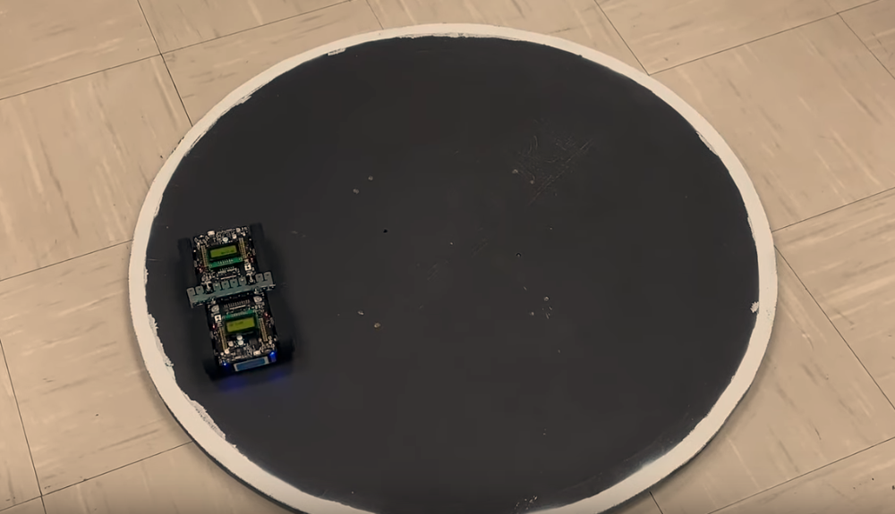
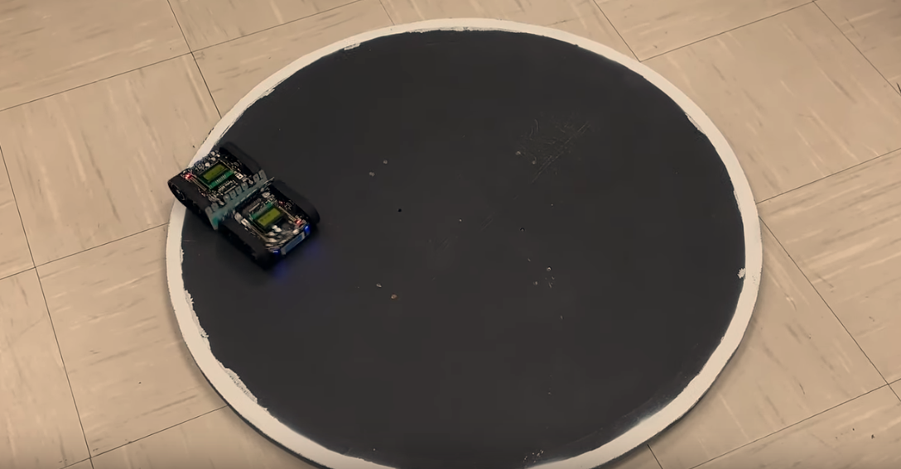

## PSoC Creator Sumo-robot-fighting  project for Metropolia Pololu Zumo Robot competition 2019 
     

## General 

- 1st year project which involves wrestling other robots to try to push them out of a ring without moving own 
  robot out of the ring
- code written in C.

## About zumo robot 
 The Pololu Zumo robot is an Arduino-controllable tracked robot platform that is less than 10 cm × 10 cm—small enough 
 to qualify for Mini Sumo. It includes two micro metal gearmotors coupled to a pair of silicone tracks, a stainless steel 
 bulldozer-style blade, six infrared reflectance sensors for line following or edge detection, accelerometer
 and magnetometer, and a buzzer for simple sounds and music.

## robot features and Sensors

 Integrated DRV8835 dual motor drivers
 Integrated 75:1 HP micro metal gearmotors
 Accelerometer & Magnetometer
 Gyroscope
 Reflectance sensor(6)
 IR Receiver
 Ultrasonic sensor# Sumo-robot-fighting-
